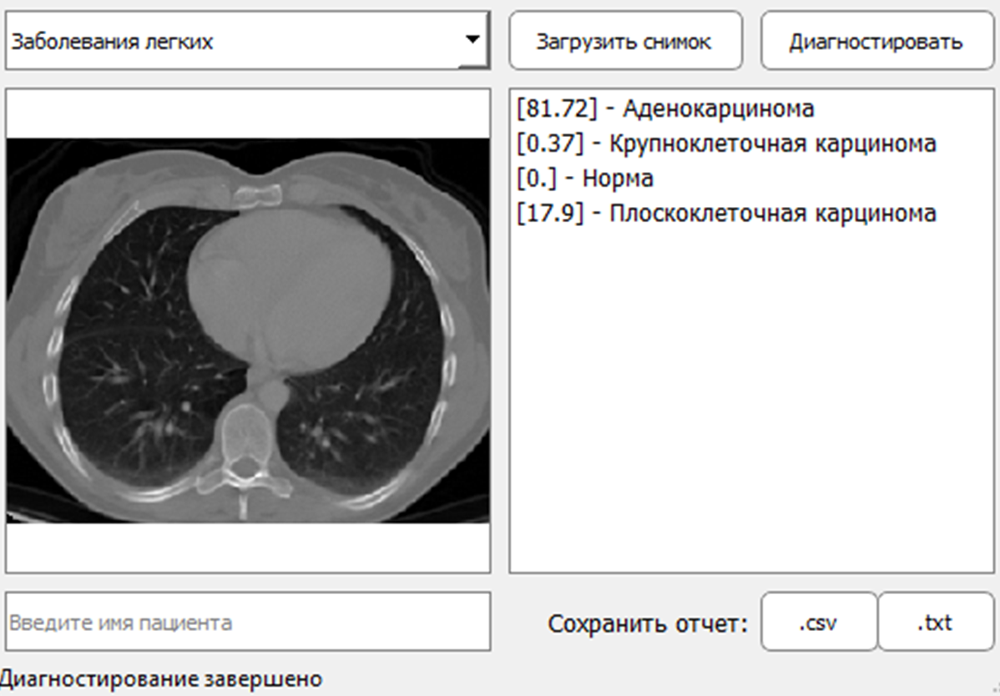

# CNN-Medical-Image-Classification

Моя выпускная квалификационная работа 2022 года, перетекшая в исследование в аспирантуре. Загружена в архивных целях.

## Этапы работы
**В рамках ВКР 2022 года:**
- Смоделирована и обучена сверточная нейронная сеть для классификации COVID-19 по снимкам легких, в итоговую работу модель не вошла
- Смоделированы и обучены 3 модели CNN для классификации онкологических заболеваний легких, кожи и крови
- Разработано приложение, способное выдавать процентную вероятность наличия заболевания на получаемом медицинском снимке

**В рамках исследования в аспирантуре:**
- Проводилось исследование способов улучшения эффективности моделей сверточных нейронных сетей для решения задачи классификации медицинских изобрежений
- Проведено сравнение различных моделей трансферного обучение CNN на медицинских данных с применением тонкой настройки и без
- Проведено исследование методов аугментации данных и их влияния на итоговую производительность модели
- Построен ансамбль из трех наиболее эффективных трансферных моделей для определения меланомы кожи по фото

